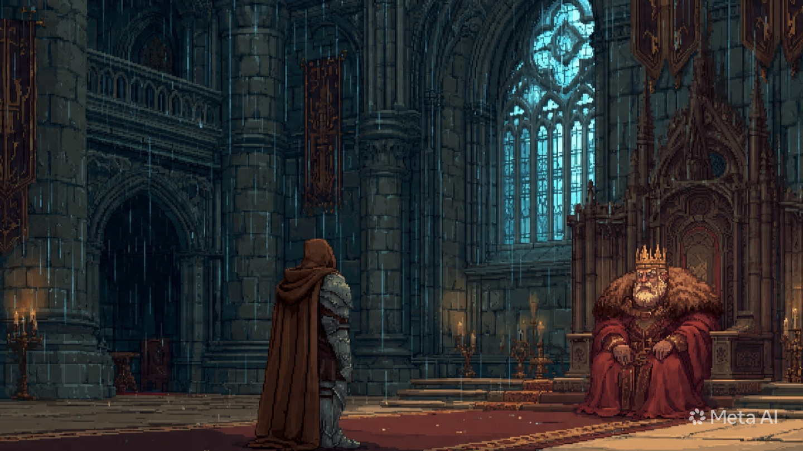
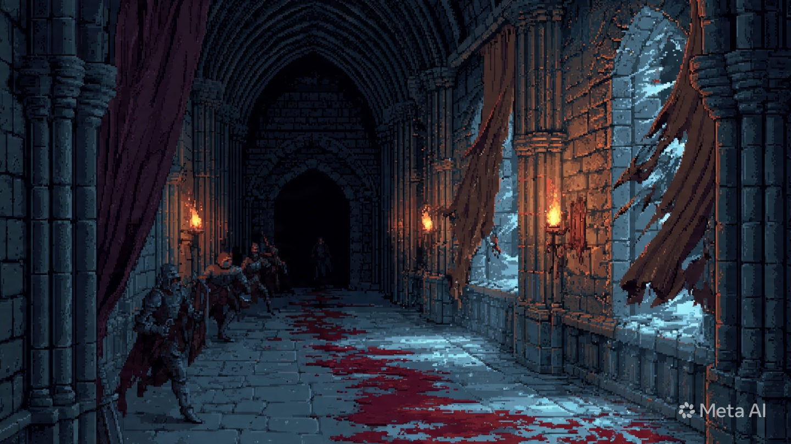
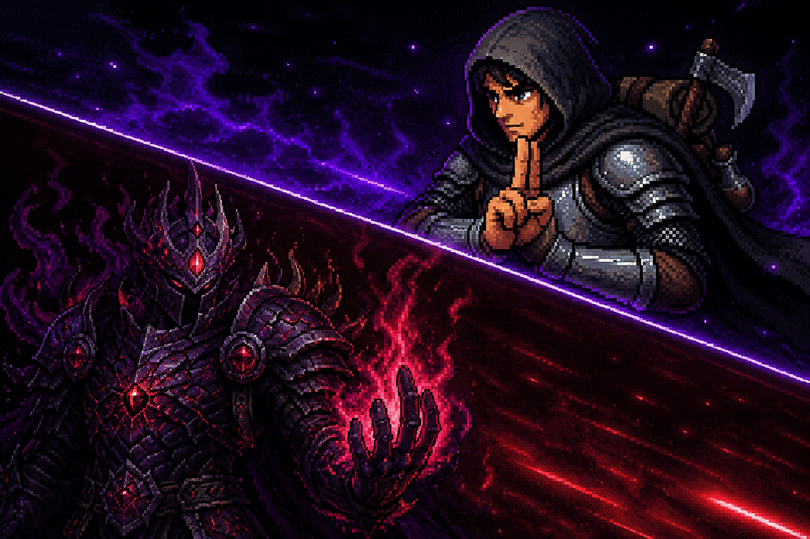
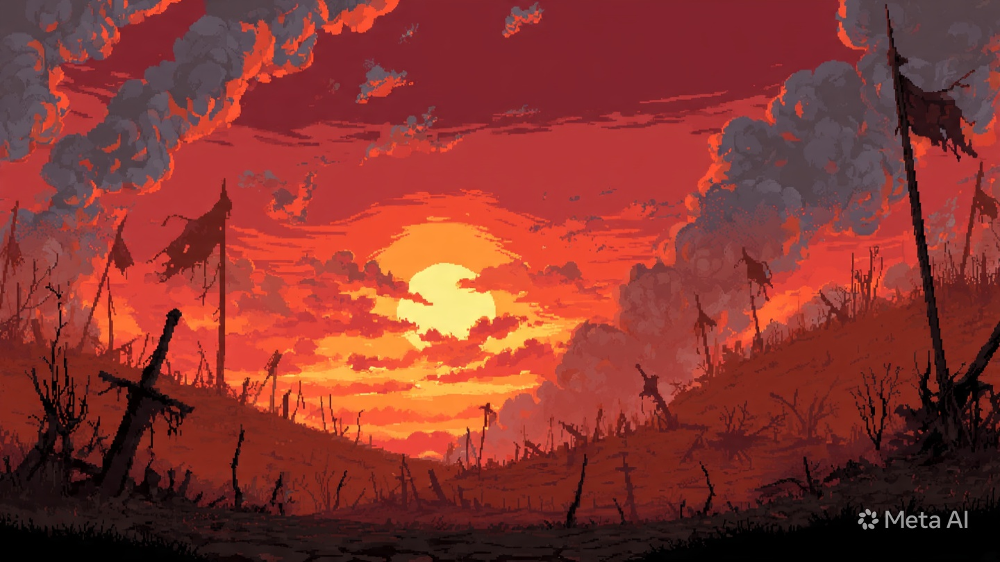
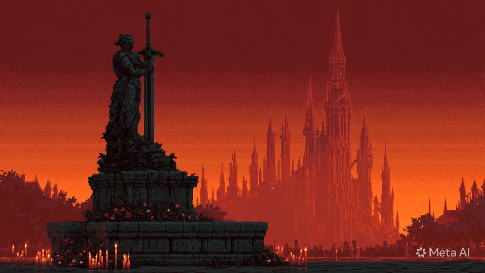

# Aelindra: The Forsaken Knight

> Dark fantasy 2D action RPG berbasis **Phaser 3 + React + Zustand + TypeScript**.  
> Kisah pengkhianatan, kebenaran, dan pengorbanan terakhir seorang ksatria terbuang.

---

## Overview

**Aelindra: The Forsaken Knight** adalah side-scrolling action RPG dengan fokus pada:

- combat cepat dan berat (hit-stop, parry, dash i-frame)
- cinematic story flow (prologue, boss cinematic, final ending, epilogue)
- progression RPG (level, skill tree, equipment, quest, shop)
- atmosfer dark fantasy pixel-art dengan nuansa naratif kuat

---

## Core Features

- **Responsive Combat System**
  - light combo, charged attack, parry/counter, ultimate
- **Boss Multi-Phase Fights**
  - termasuk final boss: **Ashen Knight**
- **Zone Round Progression**
  - tiap zone punya urutan combat + story beats sendiri
- **Dialogue & Narrative Layer**
  - typewriter dialogue, portrait, emotion tone, narration scenes
- **RPG Progression**
  - EXP/leveling, stat growth, skill unlock, gold economy
- **Inventory + Shop**
  - equipment, consumables, upgrade weapon/armor
- **Save/Load (3 Slots)**
  - via `localStorage`
- **Final 6-Frame Cinematic Ending**
  - letterbox, scanline, grain, jitter, flash transition, fade-to-black
- **Seamless Ending Audio Flow**
  - music menyambung dari boss clear -> cinematic -> ending -> epilogue tanpa reset

---

## Cutscene Highlights

- **Prologue Cinematic**
  - pembuka cerita bergaya visual novel, membangun tragedi awal Alden
- **Ashen Knight Pre-Boss Cinematic**
  - transisi dramatis sebelum pertarungan final dimulai
- **Final 6-Frame Stop-Motion Ending**
  - urutan frame sinematik setelah boss kalah:
  - The Final Strike
  - Ashen Dissolution
  - The Wounded Knight
  - The Princess Runs
  - The Final Embrace
  - The Monument
- **Ending Dialogue Sequence**
  - narasi penutup emosional dengan transisi langit/atmosfer bertahap
- **Epilogue Screen**
  - closure dunia pasca perang dengan tone reflektif

---

## Visual Preview

<table>
  <tr>
    <td align="center"><strong>Prologue</strong></td>
    <td align="center"><strong>Tragedy</strong></td>
  </tr>
  <tr>
    <td></td>
    <td></td>
  </tr>
  <tr>
    <td align="center"><strong>Final Clash</strong></td>
    <td align="center"><strong>Battlefield Mood</strong></td>
  </tr>
  <tr>
    <td></td>
    <td></td>
  </tr>
  <tr>
    <td align="center"><strong>Ending Dialogue</strong></td>
    <td align="center"><strong>Memorial</strong></td>
  </tr>
  <tr>
    <td></td>
    <td></td>
  </tr>
</table>

---

## Story Arc (Short)

1. **Alden** difitnah membunuh Raja Aldric oleh **Valther**  
2. Melarikan diri dari eksekusi dengan bantuan **Old Edric**
3. Menelusuri tujuh wilayah untuk mengungkap segel kegelapan kuno
4. Menghadapi para guardian terkutuk
5. Bertarung melawan wujud final Valther: **Ashen Knight**
6. Menyelamatkan Aelindra dengan harga yang sangat mahal

---

## World & Stages

| Stage | Zone | Atmosfer |
|---|---|---|
| 1 | Harrowmere Village | desa muram, awal pelarian |
| 2 | Fogbound Forest | hutan berkabut, makhluk korup |
| 3 | Aelindra Castle Ruins | reruntuhan kerajaan dan kutukan |
| 4 | Sunken Catacombs | lorong tulang dan kegelapan |
| 5 | Cathedral of Ash | altar sunyi penuh abu |
| 6 | Frostpeak Summit | puncak beku dan sumpah kuno |
| 7 | Ruined Battlefields | panggung pertarungan terakhir |

---

## Controls

| Input | Action |
|---|---|
| `WASD` | Move |
| `W` / `Space` | Jump / Double Jump |
| `Shift` / `Space` | Dash |
| `L` / `Mouse Left` | Light Attack |
| `Hold L/M1` | Charged Attack |
| `F` | Parry / Counter |
| `Mouse Right` | Ultimate (Forsaken Slash) |
| `E` | Interact / Advance Dialogue |
| `Tab` | Inventory |
| `Esc` | Pause Menu |

---

## Dev Tools (Testing)

Panel dev tersedia di dalam game untuk QA flow cepat:

- tombol launcher: `;`
- toggle panel: `F10`

Fitur:

- jump ke zone mana pun
- open ending/epilogue langsung
- trigger event `boss-died (ashen_knight)` untuk test final cinematic flow

---

## Tech Stack

- **Runtime/Game Engine**: Phaser 3
- **UI Layer**: React 18
- **State Management**: Zustand + Immer
- **Language**: TypeScript
- **Build Tool**: Vite 5
- **Styling**: Tailwind CSS + custom CSS

---

## Project Structure

```text
src/
  components/      # React wrappers (Phaser host, overlays)
  scenes/          # Phaser scenes (GameplayScene, PreloadScene)
  entities/        # Player, Enemy, Boss, NPC
  systems/         # MapSystem, storyData, world logic
  ui/              # HUD, Dialogue, Pause, Ending, Epilogue, DevTools
  store/           # Zustand game store (single source of truth)
  utils/           # constants, bgm, shared types
public/assets/
  images/
  audio/
  cinematic/       # final cinematic frame_1..6
```

---

## Getting Started

### 1. Install

```bash
npm install
```

### 2. Run Dev Server

```bash
npm run dev
```

### 3. Type Check

```bash
npx tsc --noEmit
```

### 4. Production Build

```bash
npx vite build
```

---

## Audio Notes

- tiap zone punya BGM berbeda
- `ending` dan `epilogue` memakai track yang sama untuk transisi emosional kontinu
- final boss path sekarang memainkan track ending dari momen boss clear

---

## Credits

Game universe: **Aelindra**  
Main character: **Alden**  
Built with Phaser + React for narrative-action hybrid gameplay.
Dev:Alxyzz
