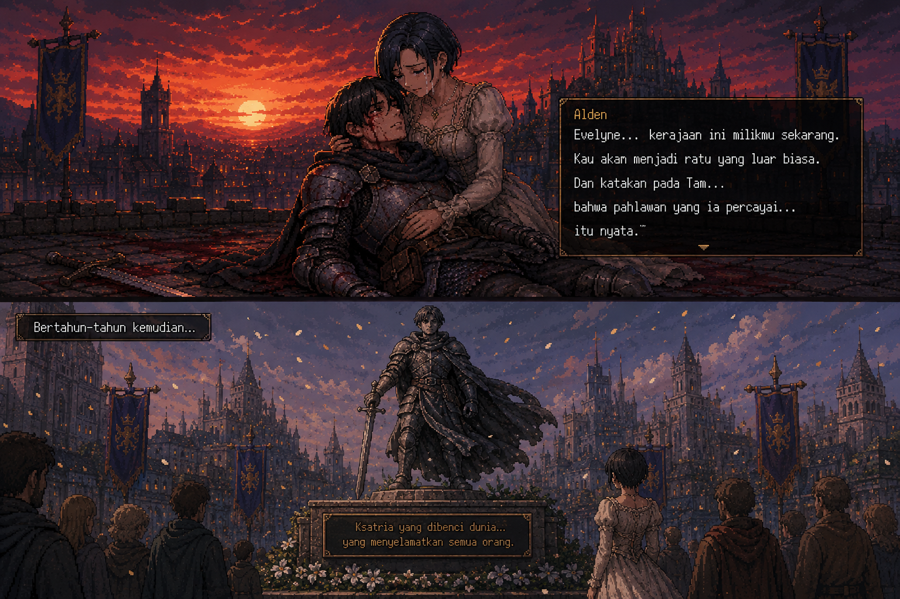

# Aelindra: The Forsaken Knight

*Game Action RPG 2D dark fantasy bergaya pixel art yang dibangun menggunakan React & Phaser 3.*

---

## Gambaran Umum

**Aelindra: The Forsaken Knight** adalah game action RPG side-scrolling yang berfokus pada cerita emosional, pertarungan intens, dan atmosfer dunia fantasi kelam. Pemain akan mengikuti perjalanan seorang ksatria yang difitnah sebagai pembunuh rajanya sendiri.

Dengan perpaduan combat cepat, sistem parry, skill tree, inventory, quest, shop, serta sinematik bergaya visual novel — game ini menghadirkan kisah tentang pengkhianatan, penebusan dosa, dan pengorbanan terakhir seorang pahlawan.

---

# Lore & Cerita Dunia

## Kerajaan Aelindra

Di kerajaan **Aelindra**, cahaya lilin hampir tidak pernah mampu mencapai sudut tergelap aula kastil. Di balik kemegahan kerajaan, tersembunyi kekuatan kuno yang perlahan bangkit dari kedalaman.

Di tengah tragedi tersebut berdiri seorang ksatria setia bernama **Alden** (atau nama yang kau pilih), prajurit kerajaan yang mengabdikan hidupnya untuk melindungi Raja **Aldric** dan rakyat Aelindra.

Namun, satu malam mengubah segalanya.

---

## Alur Cerita Utama

### 1. Pengkhianatan

Alden menemukan Raja Aldric tewas bersimbah darah di ruang kerajaan. Sebelum ia sempat menjelaskan apa yang terjadi, seorang petinggi kerajaan bernama **Valther** menuduhnya sebagai pelaku pembunuhan.

Putri kerajaan, **Evelyne**, yang dipenuhi kesedihan dan amarah, mempercayai fitnah tersebut dan memerintahkan Alden dihukum mati saat fajar tiba.

---

### 2. Pelarian dari Penjara

Pada malam sebelum eksekusi dilaksanakan, seorang pandai besi tua bernama **Old Edric** membebaskan Alden secara diam-diam dari penjara kerajaan.

Dipaksa melarikan diri dari tanah yang dulu ia lindungi, Alden memulai perjalanan untuk mencari kebenaran di balik kematian sang raja.

---

### 3. Ksatria yang Terbuang

Dalam persembunyiannya di **Harrowmere Village**, Alden melindungi warga desa dari serangan mayat hidup dan monster kegelapan.

Seorang anak kecil bernama **Tam** menjadi orang pertama yang percaya kepadanya:

> "Orang jahat tidak akan menyelamatkan ibuku dari monster."

Edric memberikan sebuah pedang legendaris bernama **The Forsaken Blade** sebagai bekal perjalanan.

---

### 4. Rahasia Kegelapan

Di dalam **Fogbound Forest**, Alden bertemu dengan **Wandering Nun** — seorang biarawati pengembara yang mengungkap kebenaran mengerikan.

Valther ternyata telah membuat perjanjian dengan kekuatan kuno yang tersegel di bawah Kastil Aelindra. Pembunuhan Raja Aldric merupakan bagian dari ritual untuk menghancurkan segel pertama dari empat segel kuno.

---

### 5. Raja yang Terkutuk

Alden kembali ke reruntuhan **Aelindra Castle Ruins** dan menghadapi **The Blind King** — arwah mantan pelindung kerajaan yang telah dirasuki kegelapan. Di sisi lain, Evelyne menemukan buku harian ayahnya yang membuktikan pengkhianatan Valther dan memohon maaf pada Alden.

---

### 6. Katakombe Terdalam

Alden mengejar Valther ke **Sunken Catacombs** — labirin tulang dan kesunyian di bawah kastil. Di sini Valther mengungkap bahwa segel ketiga nyaris pecah dan medan perang yang hancur adalah tempat segel terakhir berada.

---

### 7. Katedral Abu

Di **Cathedral of Ash**, Alden bertemu kembali dengan Wandering Nun. Di tempat suci yang telah dinodai ini, ia menghadapi **Saint of Rot** — pelayan korup yang menjaga altar palsu Valther. Dari reruntuhan katedral, Alden menemukan relik kuno yang mengarah ke Frostpeak Summit.

---

### 8. Puncak Gunung Beku

**Frostpeak Summit** — tempat segel kuno berakar di batu dan salju. Alden mendaki gunung yang menolak pendaki berniat kosong dan menghadapi **Fallen Guardian**, penjaga sumpah yang menolak turun dari puncak.

---

### 9. Pertempuran Terakhir

Di **Ruined Battlefields**, Alden berhadapan langsung dengan Valther yang telah berubah menjadi **Ashen Knight** — wujud kolosus dari bayangan dan amarah cair. Pertarungan klimaks yang menentukan nasib seluruh Aelindra, dengan bantuan Jimat Ksatria dari Tam dan Pedupaan Suci dari Wandering Nun.

---

### 10. Akhir Perjalanan

Valther berhasil dikalahkan dan kegelapan kuno kembali tersegel. Namun luka yang diterima Alden selama pertempuran terlalu parah untuk diselamatkan.

Di bawah langit merah yang perlahan mereda, Alden mengembuskan napas terakhirnya di pangkuan Evelyne sambil berkata:

> "Evelyne... kerajaan ini milikmu sekarang.
> Kau akan menjadi ratu yang luar biasa.
> Dan katakan pada Tam... bahwa pahlawan yang ia percayai... itu nyata."

Bertahun-tahun kemudian, sebuah patung didirikan di pusat ibu kota dengan tulisan:

> **"Di sini terbaring Alden — ksatria yang dibenci dunia... yang menyelamatkan semua orang."**



---

# Gameplay & Mekanik

## Sistem Combat

Game ini menghadirkan combat side-scrolling yang responsif, cepat, dan sinematik dengan fokus pada combo attack, parry timing, impact yang terasa berat, serta efek visual yang memuaskan.

### 3-Hit Branching Combo System

Pemain dapat melancarkan kombinasi serangan unik:

1. **Light Slash 1 & 2** — Tebasan cepat dengan sistem *Hit-Stop* yang membuat setiap pukulan terasa sangat berdampak.
2. **Cyclone Slash (Finisher)** — Pada hit ke-3, pemain melepaskan serangan berputar (AoE) 360 derajat yang luas. Finisher ini memberikan efek **Bleed (DoT)** selama 5 detik pada musuh yang terkena.

### Charged Attack (Heavy Attack)

Tahan tombol serang selama 400ms untuk melancarkan heavy attack. Mengonsumsi 20 stamina dan memberikan damage 2.5x lipat dengan efek visual keemasan.

### Parry & Counter System

Tekan **F** dalam window 220ms (300ms dengan skill Iron Reflex) untuk memparry serangan musuh. Parry yang berhasil mengembalikan stamina dan memberikan celah serangan balik.

### Forsaken Slash (Ultimate Ability)

Klik kanan saat ultimate charge mencapai 100% untuk melepaskan **Forsaken Slash** — serangan dahsyat area luas dengan cooldown 15 detik yang menghasilkan efek sinematik dan damage massive.

### Status Effects

* **Stun (1s)**: Terjadi jika pemain mendaratkan serangan **Critical Hit**. Musuh akan terdiam total.
* **Bleed (5s)**: Efek kerusakan berkala dari Cyclone Slash yang menguras HP musuh.
* **Critical Hit**: 25% base chance (35% dengan skill Blood Pact), damage numbers warna emas, efek bounce dan slam.

---

## Tactical Movement & Combat Feel

### Shift Dash

Pemain dapat melakukan dash dengan tombol **Shift** atau **Space**. Dash mengonsumsi **35 Stamina** (28 dengan skill Relentless Step), memberikan *invincibility frames* selama 400ms (520ms dengan skill) untuk menghindari serangan mematikan.

### Hit-Stop System

Dunia game akan berhenti sejenak (freeze) selama 80-120ms saat serangan pemain mengenai musuh atau boss, menciptakan pengalaman pertarungan yang visceral dan presisi.

### Surgical Hitboxes

Serangan pemain menggunakan *attack hitbox* yang presisi (75x60px normal, 110x80 charged, 200x120 ultimate) untuk memastikan combat terasa adil.

---

## Skill Tree

Empat skill yang bisa di-unlock menggunakan skill points yang didapat dari leveling:

| Skill | Cost | Prerequisite | Efek |
|---|---|---|---|
| **Blade Mastery** | 1 | — | Basic & charged attack damage meningkat |
| **Relentless Step** | 1 | — | Dash cost lebih rendah, invincibility lebih panjang |
| **Iron Reflex** | 1 | Blade Mastery | Parry window melebar, stamina return meningkat |
| **Blood Pact** | 2 | Iron Reflex | Critical hit lebih keras, Bleed lebih lama |

---

## Bos yang Dihadapi

| Boss | Lokasi | Fase | Deskripsi |
|---|---|---|---|
| **Hollow Beast** | Fogbound Forest | 2 | Keputusasaan hutan yang menjelma |
| **The Blind King** | Aelindra Castle Ruins | 2 | Mantan Knight of the Dawn yang terkutuk |
| **Saint of Rot** | Cathedral of Ash | 3 | Pelayan korup altar kegelapan |
| **Fallen Guardian** | Frostpeak Summit | 3 | Penjaga sumpah yang tak pernah turun |
| **Valther** | Aelindra Castle | 4 | Arsitek kehancuran, dalang di balik segalanya |
| **Ashen Knight** | Ruined Battlefields | 3 | Wujud final Valther — Final Boss |

**Ashen Knight — Pertarungan Klimaks:**
1. **Fase I (100% - 20% HP)**: Pertarungan awal dengan pola serangan agresif.
2. **Transisi Fase II**: Boss kebal, muncul peringatan "PHASE II: UNYIELDING WILL", heal ke 2500 HP, buff statistik.
3. **Fase III "ASHEN ASCENSION"**: Boss membesar 35%, heal ke 2000 HP, melepaskan Ashen Storm, Void Teleport, Sword Rain, Dark Wave, dan memanggil minion.

---

# Stage & Dunia

Petualangan Alden terbagi menjadi tujuh wilayah utama dengan suasana visual dan tantangan yang berbeda.

| Stage | Lokasi | Deskripsi |
|---|---|---|
| 1 | **Harrowmere Village** | Desa hujan tempat Alden memulai pelariannya |
| 2 | **Fogbound Forest** | Hutan berkabut yang dipenuhi monster bayangan |
| 3 | **Aelindra Castle Ruins** | Reruntuhan kastil penuh badai petir dan kutukan |
| 4 | **Sunken Catacombs** | Lorong bawah tanah kuno yang lembap dan gelap |
| 5 | **Cathedral of Ash** | Katedral sunyi dengan altar penuh abu |
| 6 | **Frostpeak Summit** | Puncak gunung beku tempat segel kuno berakar |
| 7 | **Ruined Battlefields** | Medan perang tandus tempat pertarungan terakhir terjadi |

---

# Sistem Progression

## Leveling & Stats

Pemain mendapatkan EXP dari mengalahkan musuh. Setiap level memberikan:
- +15 HP Maks, +5 Stamina, +8 Mana
- +3 Attack, +2 Defense
- +1 Skill Point

## Equipment & Inventory

- **3 Equipment Slots**: Weapon, Armor, Accessory
- **Rarity System**: Common, Uncommon, Rare, Epic, Legendary — masing-masing dengan border dan glow berbeda
- **Items**: Health Potion, Iron Longsword, Forsaken Blade, Tattered Knight's Plate, Ring of the Wanderer, dll.
- **Inventory**: 6x3 grid, bisa equip, use, inspect item

## Shop (Edric's Blacksmith)

- **Weapon Upgrade**: +3 Attack per level
- **Armor Upgrade**: +2 Defense per level
- **Consumables**: Healing Draught (restore 50 HP)

## Quest System

- Main quests & side quests
- Objectives dengan progress tracking
- Rewards: EXP & Gold

## New Game+ (Cycles)

Setelah menyelesaikan game, pemain bisa memulai siklus baru dengan akumulasi stats yang sudah didapat.

---

# Sistem UI & Layar

## Layar yang Tersedia

- **Title Screen** — Particle efek, castle silhouette SVG, animated title, "Begin the Journey" & "Continue"
- **Prologue Cinematic** — 17 slide visual novel-style dengan typewriter animation, rain effect, portraits
- **Name Input Screen** — Custom knight naming, 5 preset names, starting items
- **HUD** — HP bar, Stamina bar, zone name, level, cycle, skill points, combo counter, ultimate charge
- **Pause Menu** — 6 tab: Main, Skills, Settings, Controls, Save, Quests
- **Inventory** — Grid item management dengan equip/use system
- **Dialogue System** — Typewriter text, portraits, emotion colors, blip sound
- **Boss Health Bar** — HP bar dengan phase indicators
- **Shop** — Upgrade & beli item dari Old Edric
- **Notifications** — 5 tipe notifikasi (info, success, warning, danger, lore)
- **Game Over Screen** — "Rise Again" (40% HP), "Load Last Save", "Return to Title"
- **Ending Screen** — 26 timed text lines, dawn transition, ember particles, statue scene
- **Epilogue Screen** — 19 lines post-ending closure, fade-in text

## Controls

| Key | Aksi |
|---|---|
| WASD | Movement |
| W / Space | Jump / Double Jump |
| Space / Shift | Dash (Stamina cost) |
| L / Mouse 1 | Light Attack |
| Hold L/M1 | Heavy / Charged Attack |
| F | Parry / Counter |
| Right Click | Forsaken Slash (Ultimate) |
| E | Interact / Talk |
| Tab | Inventory |
| Esc | Pause Menu |

## Save System

- 3 save slots (localStorage)
- Auto-save di NPC checkpoint
- Informasi: timestamp, playtime, zone, level
- Load dari pause menu atau game over screen

---

# Audio & Sound Design

## Background Music

- Setiap stage memiliki backsound unik
- Musik spesial untuk prologue, ending, dan epilogue
- Transisi musik otomatis antar area

## Sound Effects

- 4 variasi suara tebasan pedang
- Critical hit impact
- Footstep system
- Monster ambience
- Dialogue blip sound

## Audio Settings

Pause menu menyediakan pengaturan:

- Master Volume
- Music Volume
- SFX Volume
- Ambient Volume

Semua pengaturan tersimpan otomatis. Tersedia juga opsi Damage Numbers, Screen Shake, FPS display, dan Particle Quality (low/medium/high).

---

# Teknologi yang Digunakan

## Core Technology

- React ^18.2.0
- Phaser 3 ^3.60.0
- TypeScript ^5.0.0
- Vite ^5.0.0

## State Management

- Zustand ^4.4.7
- Immer middleware

## Styling & UI

- TailwindCSS 3
- Google Fonts: Cinzel, Cinzel Decorative, Lora
- Vanilla CSS

## Audio System

- HTML Audio API
- Phaser Sound System


# Cara Main Game nya
```bash
npm install
npm run dev
```
